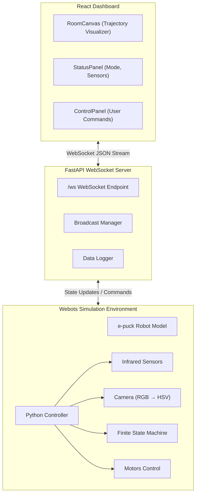
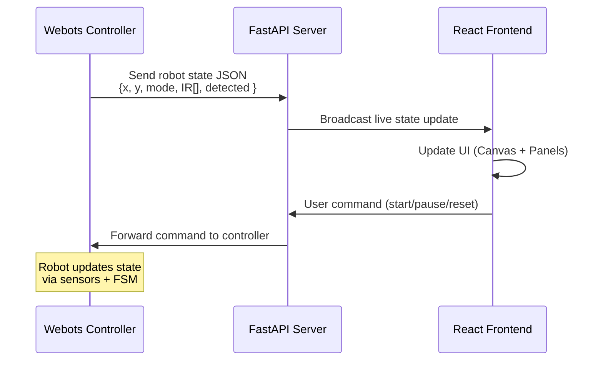
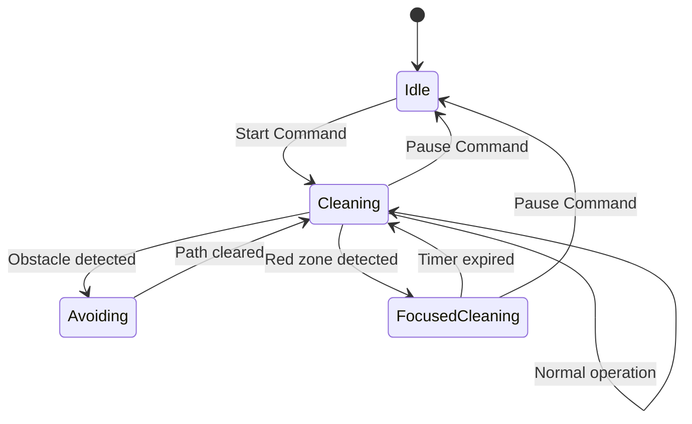
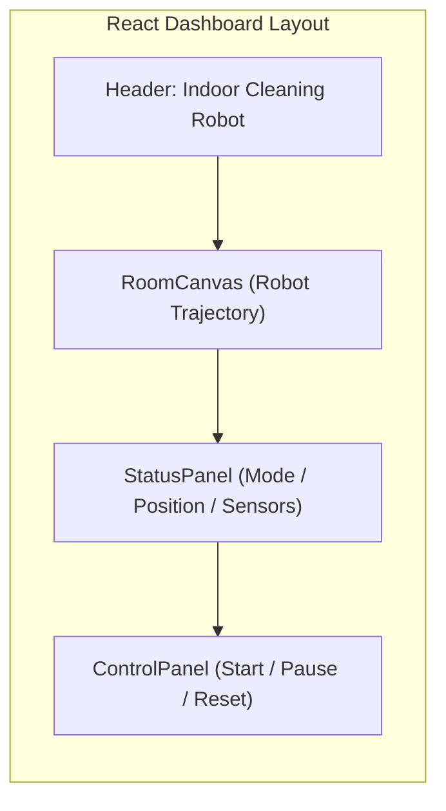

# 🧹 Indoor Cleaning Robot – Webots Simulation Project

## 🧠 Overview

This project explores **autonomous indoor cleaning** using a simulated robot in **Webots**.
The robot autonomously navigates a cluttered room, avoids obstacles, and detects high-priority cleaning zones (red carpets).
It demonstrates **sensor fusion**, **reactive control**, **vision-based behavior switching**, and **real-time visualization**.

---

## 🎯 Objectives

* Implement a **hybrid perception system** combining infrared sensors and a camera.
* Develop **behavior-based control** using a finite-state machine (FSM).
* Design a real-time **dashboard** showing trajectory, status, and sensor feedback.
* Evaluate robustness under different lighting, obstacles, and failure scenarios.

---

# 🏗️ System Architecture

Below is the high-level system architecture (Mermaid diagram):



---

# 🔄 Data Flow Diagram



---

# 🤖 Robot Behaviour (Finite State Machine)



---

# 🖥️ Dashboard UI Layout



---

## 📦 Project Structure

```
indoor-cleaning-robot/
├── webots_controller/
│   ├── cleaner_controller.py
│   ├── sensors.py
│   ├── vision.py
│   ├── motors.py
│   ├── state_machine.py
│   └── utils.py
│
├── backend/
│   ├── app.py
│   ├── websocket_manager.py
│   └── data_logger.py
│
├── frontend/
│   ├── src/
│   ├── vite.config.js
│   └── package.json
│
└── docs/
    ├── report.pdf
    └── design_diagram.png (optional)
```

---

## 🧮 Core Features

* **Obstacle Avoidance**
  Reactive control using infrared proximity sensors.

* **Red Zone Detection**
  HSV-based color segmentation to detect “dirty zones”.

* **Focused Cleaning Mode**
  Robot pauses and cleans when inside the detected red area.

* **Real-time Visualization**
  React dashboard displays trajectory, robot mode, and sensor values.

* **Experiment Logging**
  Data recorded for analysis (coverage, collisions, false detections, etc.).

---

## 🧪 Running the Project

### 1. Start Backend

```bash
cd backend
uvicorn app:app --reload
```

### 2. Start Frontend

```bash
cd frontend
npm install
npm run dev
```

### 3. Run Simulation in Webots

* Load world file
* Assign controller: `cleaner_controller.py`
* Run simulation

---

## 🔬 Experimental Evaluation

Experiments include:

| Experiment         | Description           | Metrics                |
| ------------------ | --------------------- | ---------------------- |
| Navigation Test    | Obstacle handling     | Collisions, smoothness |
| Red Zone Detection | Lighting variations   | Detection accuracy     |
| Focused Cleaning   | Behaviour transitions | Response time          |
| Robustness         | Random obstacles      | Stability              |

Full details are in `docs/report.pdf`.

---

## ⚠️ Limitations

* No global path planner (purely reactive).
* Color detection sensitive to illumination.
* Narrow sensor angle may miss thin obstacles.
* Occasional false positives at red edges.

---

## 📁 Repository Notes

* Robot model used: **e-puck** (Cyberbotics)
* Core logic implemented by the project team
* Standard libraries only; no pre-built navigation packages

---

## 🔗 Deliverables

* Report (IEEE format, 6 pages max)
* 5-minute demo video
* Public GitHub repository (this repo)

---

## 📜 License

MIT License – for academic and research use.
